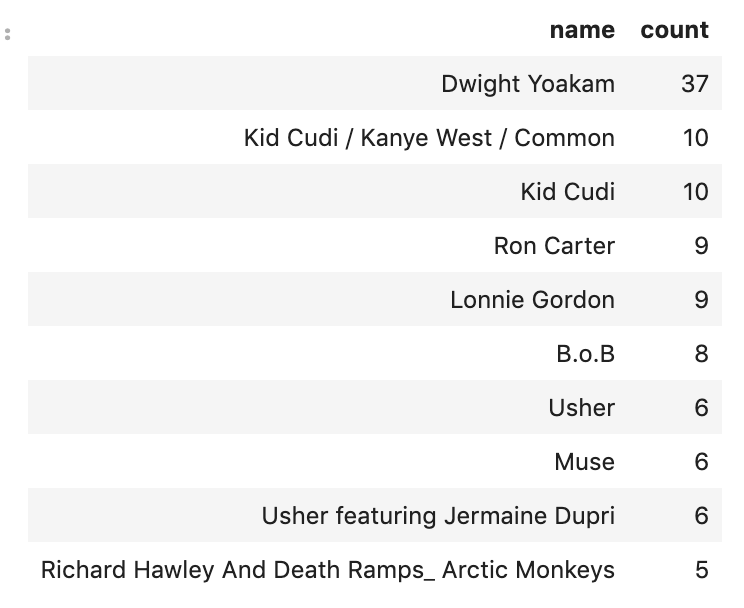
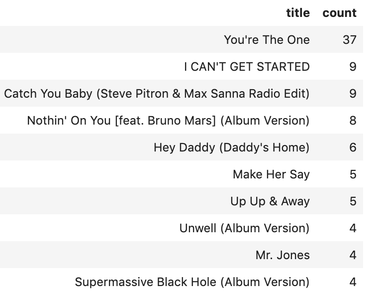

## Introduction
A music streaming startup, Sparkify, has grown their user base and song database and want to move their processes and data onto the cloud. Their data resides in S3, in a directory of JSON logs on user activity on the app, as well as a directory with JSON metadata on the songs in their app.

### Project Description
The task is build an ETL pipeline that extracts data from S3, stages them in Redshift, and transforms data into a set of dimensional tables for their analytics team to continue finding insights in what songs their users are listening to. 

### Staging Tables

The tables below will be used to hold the information from the S3 json files before the information be processed.

* staging_events
* staging_songs

#### Staging Tables information

**staging_events**

Hold the information from log files, the table contais the columns (artist_name, auth, first_name, gender, item_Session, last_name, length, level, location, method, page, registration, session_id, song_title, status, start_time, user_agent, user_id) for sorting is used the column item_session and the style All.

**staging_songs**

Hold the information from the song files, the table contains the columns (num_songs, artist_id, latitude, longitude, location, artist_name, song_id, title, duration, year) for distribuition and sorting is used sond_id and style all.

### Analytics Tables

Below the tables the Analytic Team will process their queries after the processing the information.

* Fact Table
  * songplays: records in event data associated with song plays.

* Dimension Tables
  * users
  * songs
  * artists
  * time

For the distribuition, sorting and primary key was keep the same columns of the first project and style all.

### Files information

The files belows are used in the project.

- create_table.py create your fact and dimension tables for the star schema in Redshift.
- etl.py is load data from S3 into staging tables on Redshift and then process that data into analytics tables on Redshift.
- sql_queries.pySQL statements, which will be imported into the two other files above.
- dwh.cfg configuration file with the password, keys and information of the Redshift Cluster

### Extract, Transform and Load

The data from S3 files will be load in the staging tables (staging_events, staging_songs), the information is processed and load in the analytics tables (songplays, users, songs, artists, time)

### Usage

Run the scripts in the following order:

- create_tables.py
- etl.py

### Libraries used
```
import psycopg2
import configparser
from sql_queries import create_table_queries, drop_table_queries
```

### Examples

Below there are some samples of the queries can be use by the Analytic Team

#### Top 10 Artist Played

```
SELECT artists.name,
       Count(songplays.user_id) as Count
FROM   songplays
       LEFT JOIN artists
              ON ( songplays.artist_id = artists.artist_id )
WHERE  songplays.artist_id IS NOT NULL
GROUP  BY artists.name
ORDER  BY Count(songplays.user_id) DESC
LIMIT  10
```



#### Top 10 Music Played

```
SELECT songs.title,
       Count(songplays.user_id) as Count
FROM   songplays
       LEFT JOIN songs
              ON ( songplays.song_id = songs.song_id )
WHERE  songplays.artist_id IS NOT NULL
GROUP  BY songs.title
ORDER  BY Count(songplays.user_id) DESC
LIMIT  10
```

